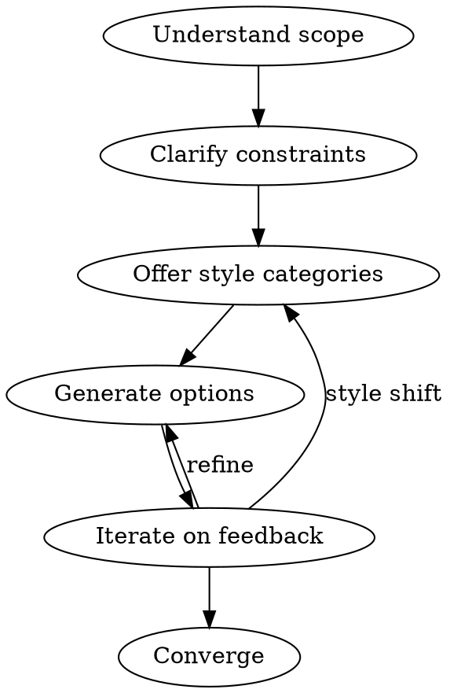

# Project Namer

## Overview

Guide users from vague naming requirements to a memorable, unique name through structured exploration of scope, constraints, and style preferences.

## When to Use

- Naming a new repository, project, tool, or product
- User is unsure what to call something
- User rejects initial suggestions as "too generic" or "too vendor-specific"

## Core Workflow

### 1. Understand Scope

Ask what the project contains and does:

- Single purpose or multi-purpose?
- What goes in it? (code, docs, tools, configs)
- Who uses it? (personal, team, public)

### 2. Clarify Constraints

Identify naming constraints:

- Vendor lock-in concerns? (avoid "claude-tools", "openai-kit")
- Technical limits? (npm name available, no special chars)
- Must work as CLI command? (short, typeable)

### 3. Offer Style Categories

Present naming styles - let user pick direction:

| Style                | Examples                      | When to suggest                      |
| -------------------- | ----------------------------- | ------------------------------------ |
| **Functional**       | toolkit, dev-tools, workflows | User wants clarity over personality  |
| **Character/Butler** | friday, jeeves, pennyworth    | User wants personality, memorability |
| **Compound**         | devbox, workstation, codekit  | Balance of clear + catchy            |
| **Metaphor**         | forge, lighthouse, compass    | Evokes purpose without stating it    |
| **Coined**           | vercel, kubectl, nginx        | Maximum uniqueness, brand potential  |

### 4. Generate Options

Within chosen style, generate 5-8 options. For each:

- Keep short (1-2 syllables preferred)
- Easy to pronounce (no awkward consonant clusters)
- Easy to type (avoid special chars, unusual spellings)
- Room to grow (not too narrow in scope)

### 5. Iterate on Feedback

Listen for signals:

- "Too generic" → move toward Character or Coined
- "Too tied to X" → broaden scope or change metaphor
- "I like the vibe of Y" → generate more in that direction
- "Not just for Z" → revisit scope understanding

### 6. Converge

When user shows interest, validate:

- Say it out loud - does it flow?
- Type it - comfortable on keyboard?
- Explain it - easy to tell others?
- Search it - is the name taken? (npm, github, domains)

## Quick Reference

**Good names are:**

- Unique (not the first thing everyone thinks of)
- Pronounceable (one way to say it)
- Memorable (sticks after hearing once)
- Short (under 10 chars ideal)
- Unexpired (room to grow)

**Avoid:**

- Acronyms (hard to remember: JATK, CDTL)
- Overused references (jarvis, alfred, hal - too derivative)
- Generic terms alone (tools, utils, helpers, kit)
- Vendor names (claude-x, gpt-y, copilot-z)
- Version numbers in name (toolkit2, tools-v3)

## Common Mistakes

| Mistake                                            | Fix                                              |
| -------------------------------------------------- | ------------------------------------------------ |
| Jumping to suggestions without understanding scope | Ask what goes in it first                        |
| Only offering one style                            | Present style categories, let user choose        |
| Giving up after one rejection                      | Rejection = information about preferences        |
| Suggesting overused pop culture                    | Dig deeper - lesser-known references or original |
